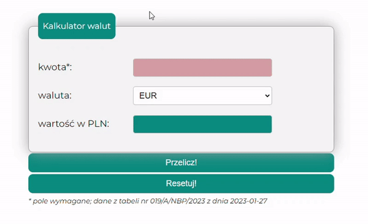

# **Currency calculator**
## **About me** ## 

Hello everyone! My name is Katarzyna. I used to work in **IT department** for the last circa 3 years as an **IT Process Coordinator**. I gained experience as a **Personal Data Officer** since Nov 2021 too. 
Impossible? Nothing is impossible if you are really into something! 
I was resposible for the procedures and instructions related with quality in the organization. As you can see my mind is open and I like to learn new things. 
Since Dec 2022 I am developing my skills in my *Frontend Developer* course by *YouCode*. 

And I will stand with this.

In my free time I am jogging through the forest near my home - in my opinion it's the best solution for your body and mind!

That's it from me for now. If you would like to know more about my eperience, please visit my [Linkedin](https://www.linkedin.com/in/katarzyna-zaloba/) .

## **Demo**: 
[Please click here to use currency converter](https://katarzynazaloba.github.io/kantorWalutowy/)

## **How it works**

It was really fun for me to taking care of my website. It's in Polish. You can count there a value from PLN into EUR, USD GBP. 

To do that you need to enter your amount of money in PLN, then you can select the currency from the list you want to convert into:
- EUR,
- USD,
- GBP.

 To get the result, you need to click the *Przelicz!* button. If you want to reset the amount in PLN and the result, you can click the *Resetuj!* button.

## **Technologies used in the project**
To create the application I have used:
- HTML
- CSS
- Normalize
- BEM convention
- JavaScript
- ES6+ features
- GIT
- Markdown
